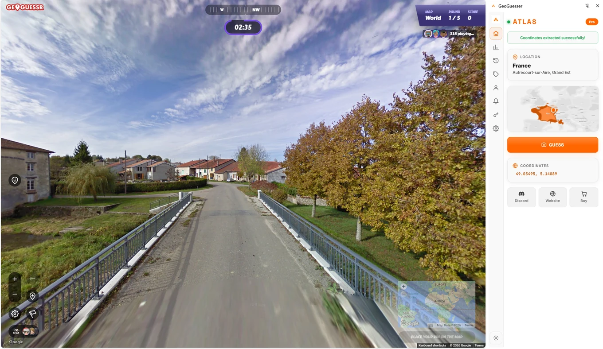
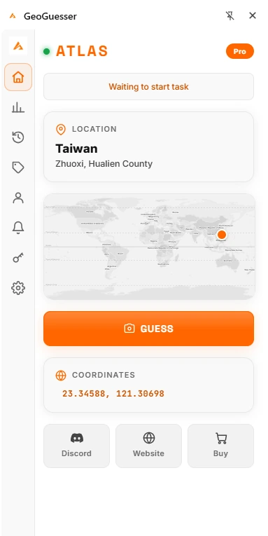

# GeoGuessr Cheat Extension for Chrome: the ATLAS Side Panel

  

  <b>A cheat extension that answers the round beside the game: country, region, coordinates, and the pin dropped for you.</b> 
  Seven rounds free, no account and no download. Chrome, Edge, Brave, Opera and Vivaldi.

  
  
  
  
  
  

  <a href="https://github.com/Sven233333/Atlas-geoguessr-bot"><b>All platforms</b></a> &middot;
  <a href="https://github.com/Sven233333/atlas-geoguessr-firefox-addon">Firefox version</a> &middot;
  <a href="https://geoguessrcheats.com/plans">Plans</a> &middot;
  <a href="https://geoguessrcheats.com/reviews">Reviews</a>

Seven rounds free. No account, no download, nothing installed on your machine
beyond an extension you can remove in two clicks. That is deliberately the
cheapest possible way to find out whether an AI can actually read a street view,
before anyone asks you for money.

Install: **[Chrome Web Store](https://chromewebstore.google.com/detail/geoguesser-cheats-geogues/mggpkondmigmgbgafalghhkagkldinkj)**

---

## The seven rounds

They are real rounds, not a demo reel. You open a game, the panel opens next to
it, and it answers seven times before it stops. Nothing is charged, nothing is
registered, and if the answers are not good enough for you, that is the end of it.

After seven, a key unlocks the rest. The same key works in the Windows app and on
your phone, so nobody pays twice for the same thing.

## What the panel puts in front of you

- the country it settled on
- the region or town inside that country
- the coordinates, so you can check the answer yourself afterwards
- a button that drops the pin on the map for you

It sits beside the game rather than on top of it. The round stays where it is and
nothing is drawn over the street view.

## Hands free

Turn it on and the extension stops waiting for you. It places the guess, presses
submit, and moves to the next round. You are still in the browser and still in the
game, but you are no longer clicking.

For playing whole sessions while you do something else entirely, that is the
Windows app rather than this:
[atlas-geoguessr-windows-app](https://github.com/Sven233333/atlas-geoguessr-windows-app).

## Which browsers this covers

Chrome itself, and the browsers built on the same engine: Edge, Brave, Opera,
Vivaldi. It also runs on macOS in Chrome, with no separate purchase, which is
written up in
[atlas-geoguessr-macos](https://github.com/Sven233333/atlas-geoguessr-macos).

Using Firefox? That version exists as well and behaves slightly differently:
[atlas-geoguessr-firefox-addon](https://github.com/Sven233333/atlas-geoguessr-firefox-addon).

## Installing it

1. Open the [Chrome Web Store listing](https://chromewebstore.google.com/detail/geoguesser-cheats-geogues/mggpkondmigmgbgafalghhkagkldinkj).
2. Add it to the browser.
3. Start a round and open the panel.
4. Seven rounds later, decide.

## Being straight about the limits

- It does not start games for you and it does not keep playing after you close the
  tab. That is what the desktop app is for.
- It reads the round as shown. It does not walk down the road looking for a road
  sign.
- Predictions come from our side rather than from your laptop, so it needs a
  working connection.

## Questions

**Is this free forever?**
Seven rounds are free. After that it needs a key. There is no trick where the
free rounds silently become a subscription.

**Do I need an account for the free rounds?**
No.

**Does it slow the browser down?**
No. The work does not happen in your tab.

**Will it work on other guessing games?**
The panel is built around street view rounds and reads more than one game. What
it will not do is pretend to support something it cannot read.

**Can I use the same key on my phone?**
Yes. See [atlas-geoguessr-ios](https://github.com/Sven233333/atlas-geoguessr-ios)
and [atlas-geoguessr-android](https://github.com/Sven233333/atlas-geoguessr-android).

**Where do I see all platforms at once?**
[geoguessrcheats.com/platforms](https://geoguessrcheats.com/platforms), or the
overview repository
[Atlas-geoguessr-bot](https://github.com/Sven233333/Atlas-geoguessr-bot).

## Disclaimer

Independent project. Not affiliated with GeoGuessr AB, Google or any browser
vendor. An assistant may be against the rules of the game or event you are in.
Check before you use it.
